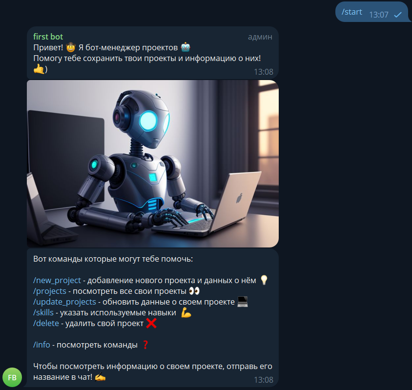
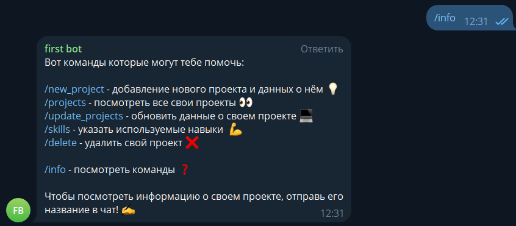
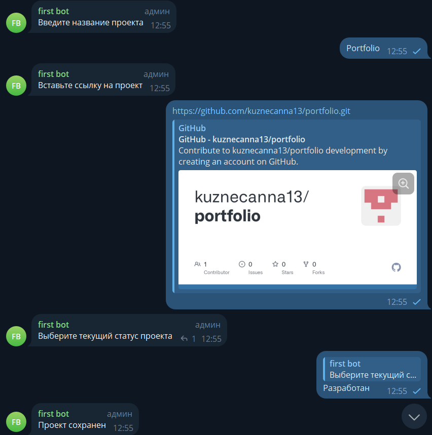
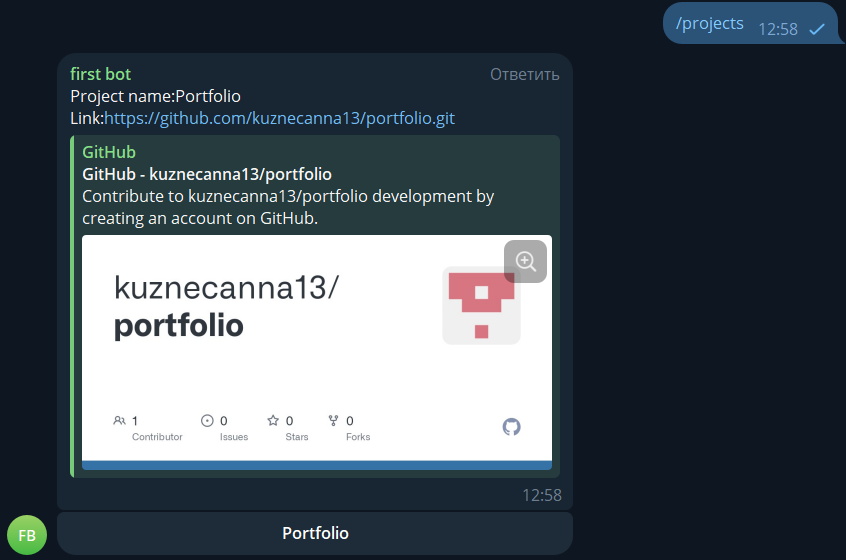
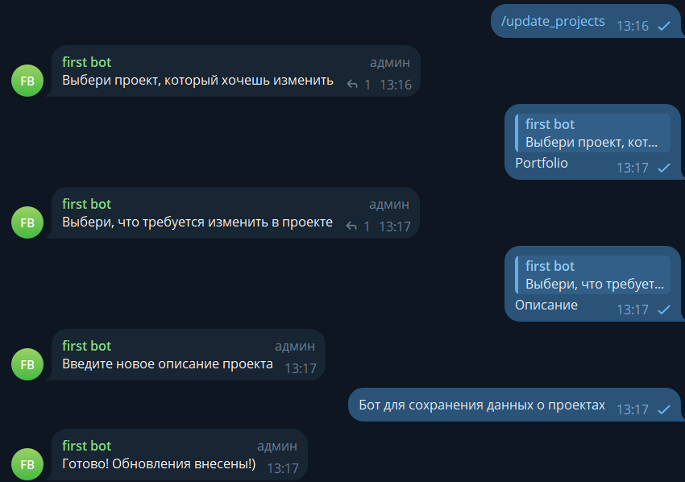
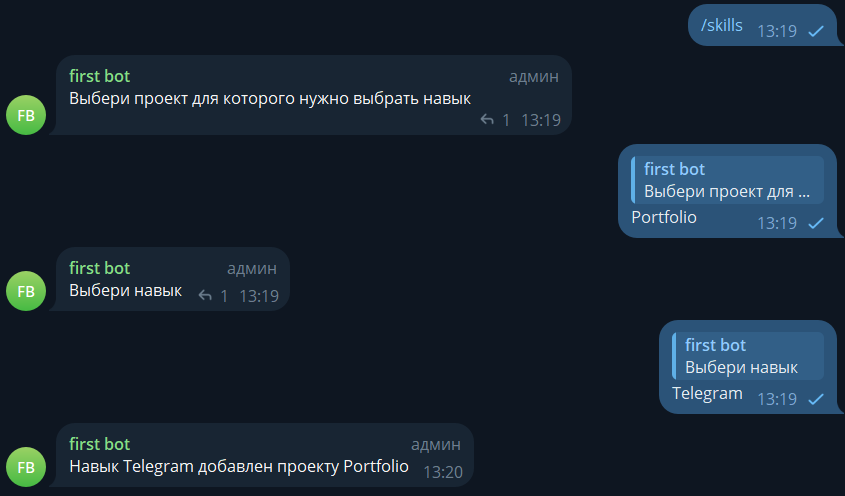
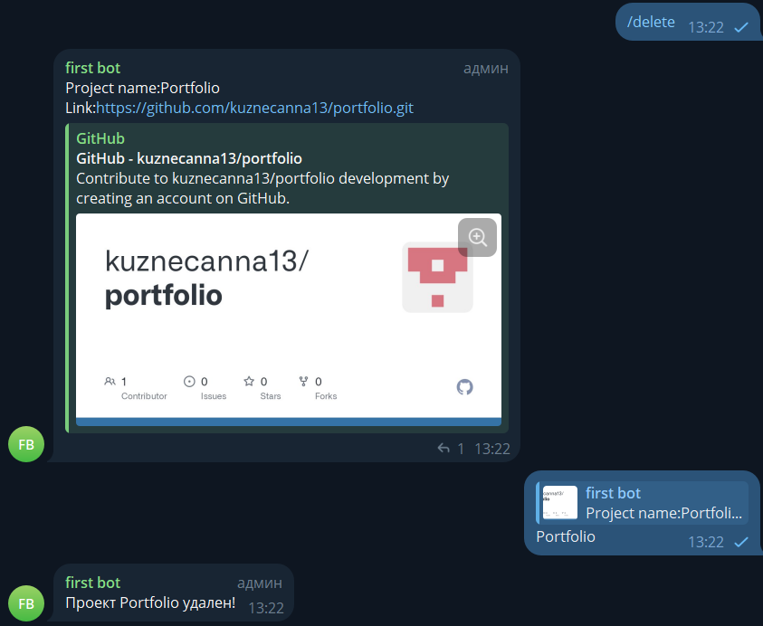
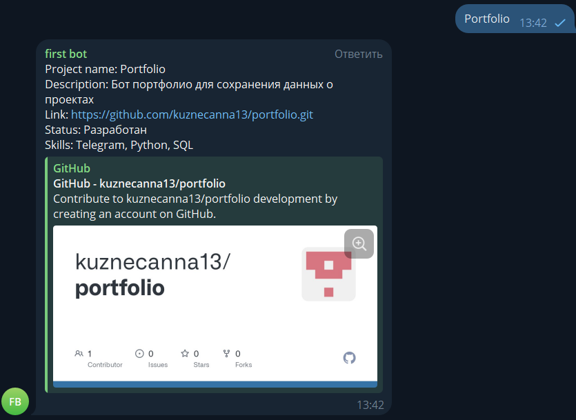

# Бот-портфолио
*Телеграм бот для сохранения данных о своих проектах*
## Команды:
* /start - вызов приветственного сообщения

* /info - список всех команд

* /new_project - добавление нового проекта

* /projects - просмотр всех проектов

* /update_projects - обновление данных

* /skills - добавить новый навык

* /delete - удалить один из проектов

* Название проекта - получить информацию о проекте

